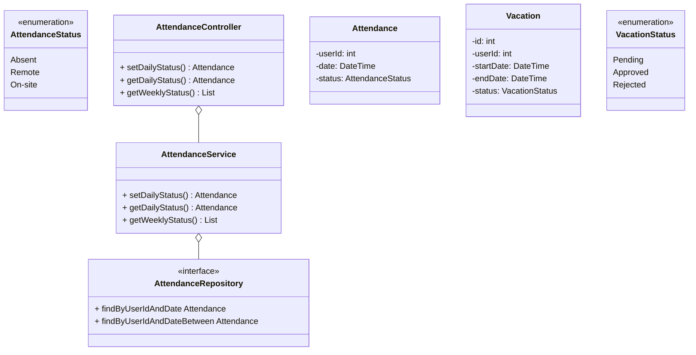
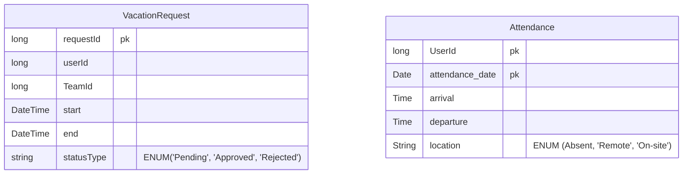

# Attendance-Api
# UML

```mermaid
classDiagram
class AttendanceStatus{
<<enumeration>>
Absent
Remote
On-site
}
class AttendanceService{
+ setDailyStatus() Attendance
+ getDailyStatus() Attendance
+ getWeeklyStatus() List<Attendance>
}
class AttendanceController{
+ setDailyStatus () Attendance
+ getDailyStatus () Attendance
+ getWeeklyStatus() List<Attendance>
}
class AttendanceRepository{
<<interface>>
+ findByUserIdAndDate Attendance
+ findByUserIdAndDateBetween Attendance
}

class Attendance{
-userId: int
-date: DateTime
-status: AttendanceStatus 
}

class Vacation{
-id: int
-userId: int
-startDate: DateTime
-endDate: DateTime
-status: VacationStatus
}
class VacationStatus{
<<enumeration>>
Pending
Approved
Rejected 
}
AttendanceController o-- AttendanceService
AttendanceService o-- AttendanceRepository

```
# ERD

```mermaid
erDiagram
VacationRequest{
long requestId pk
long userId
long TeamId
DateTime start
DateTime end
string statusType "ENUM('Pending', 'Approved', 'Rejected')"
}
Attendance{
long UserId pk 
Date attendance_date pk
Time arrival
Time departure 
String location "ENUM (Absent, 'Remote', 'On-site')"
}
```